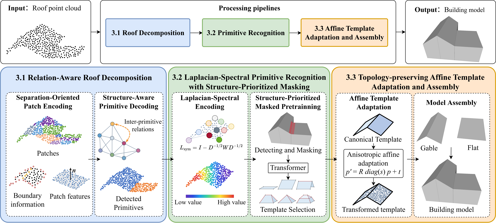
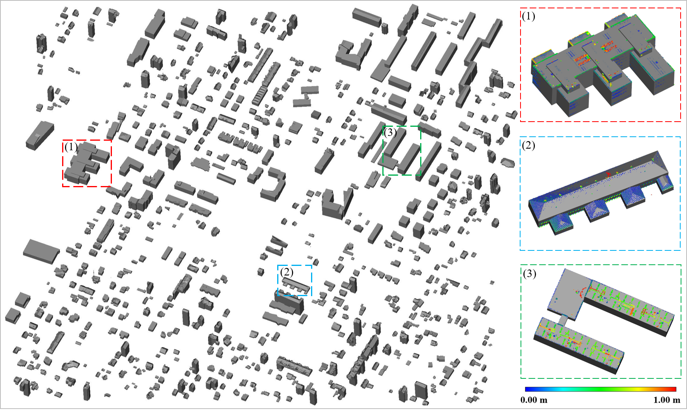
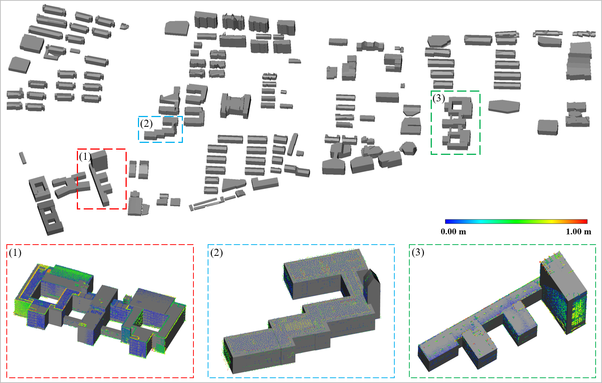
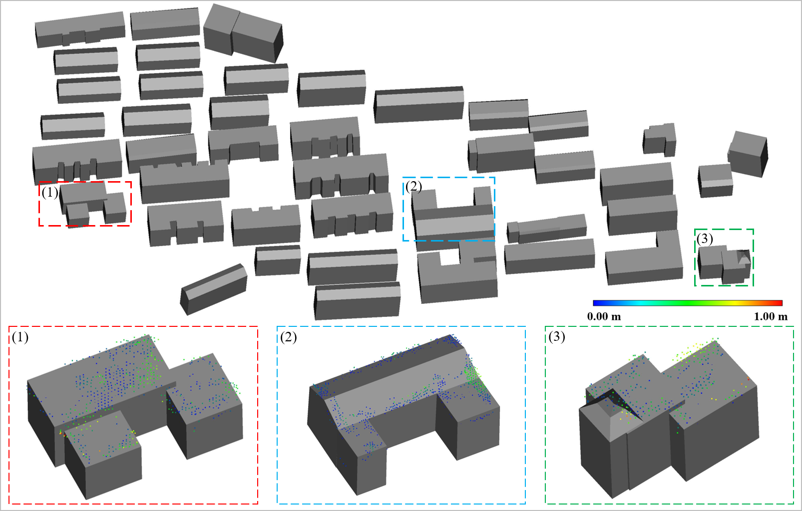

# Roof-Primitive-Aware Building Reconstruction

## Overall Workflow



*Figure 1. Overall framework of the proposed roof-primitive-aware building reconstruction method.*

## Introduction

This repository accompanies **Learn what and where; inherit how it is connected**, by Yufu Zang, Zhuokai Shi, Dong Chen, Haiyan Guan, and Bisheng Yang.

The framework reconstructs structured LoD2 building models from point clouds by learning roof-primitive geometry and placement while inheriting connectivity from canonical templates. It decomposes compound roofs, recognizes primitive categories, adapts the corresponding templates, and assembles them into a complete building envelope.

Roof decomposition combines **Separation-Oriented Patch Encoding (SOPE)** with **Structure-Aware Primitive Decoding (SAPD)**. SOPE aggregates regional context and boundary evidence from local geometric descriptors and roof-outline proximity. SAPD incorporates box relations and intrinsic geometric relations among candidate primitives to resolve boundaries at ridges, eaves, and coplanar outline transitions.

Primitive recognition combines **Laplacian-spectral encoding** with **structure-prioritized masked learning**. Spectral coordinates represent the roof-level arrangement of local point groups. During pretraining, masking prioritizes the lower side of stepping edges and valley neighborhoods, encouraging the encoder to reconstruct missing structural cues from the visible roof context. The pretrained encoder then recognizes six categories: Flat, Shed, Gable, Hip, Pyramid, and Mansard.

**Topology-preserving affine template adaptation** uses a shared point Transformer and target-to-template cross-attention to estimate rotation, anisotropic scale, and translation. Applying this transformation to template vertices preserves each primitive's predefined faces and connectivity. Geometric refinement aligns neighboring primitives, and wall and bottom completion produce the final LoD2 envelope.

This repository provides the core method modules. **The full code and data will be uploaded after the paper is accepted.**

## Environment Requirements

The implementation runs on Linux or Ubuntu under WSL with Python 3.10, PyTorch 2.5.1, and CUDA runtime 12.4. Experiments were conducted on an NVIDIA RTX 3090 GPU with 24 GB of memory.

Create and activate the environment:

```bash
conda env create -f environment.yml
conda activate roof-primitive
```

The [environment.yml](environment.yml) specifies package versions and installation sources.

## Data

**The full code and data will be uploaded after the paper is accepted.**

Dataset download: [Google Drive](https://drive.google.com/drive/folders/1HRBJz_U6rfd44xCufWqTk-m_oxhZZFt-?usp=sharing).

## Modeling Results



*Tallinn.*



*NUIST campus.*



*WHU campus.*


| Dataset | Mean vertices | Mean faces | Mean CD (cm) | RMSE (cm) | Edge precision (%) | Edge recall (%) | 2-Manifold (%) |
| --- | ---: | ---: | ---: | ---: | ---: | ---: | ---: |
| Tallinn | 66.40 | 47.50 | 23.98 | 10.42 | 91.12 | 89.79 | 97.26 |
| NUIST campus | 51.70 | 36.90 | 17.24 | 7.55 | 94.48 | 93.37 | 99.29 |
| WHU campus | 37.30 | 26.60 | 30.36 | 13.47 | 87.85 | 86.63 | 95.24 |
| Overall, macro-average across scenes | 51.80 | 37.00 | 23.86 | 10.48 | 91.15 | 89.93 | 97.26 |

Across the three scenes, the framework achieves a macro-averaged mean Chamfer distance of **23.86 cm** and RMSE of **10.48 cm**, with **37.00 faces per building**. Edge precision, edge recall, and 2-Manifold validity reach **91.15%**, **89.93%**, and **97.26%**, respectively, demonstrating compact reconstruction with accurate geometry and coherent connectivity.

Primitive decomposition achieves **91.63% AP** and **92.81% AR**, and six-category recognition achieves **93.04% overall accuracy**. Downloadable reconstructed models will accompany the full release after acceptance.

## Citation

Use the following entry to cite the manuscript. Publication metadata will be updated after acceptance.

```bibtex
@misc{zang_roof_primitive_reconstruction,
  title  = {Learn what and where; inherit how it is connected},
  author = {Zang, Yufu and Shi, Zhuokai and Chen, Dong and Guan, Haiyan and Yang, Bisheng},
  note   = {Manuscript; publication details will be updated after acceptance},
  url    = {https://github.com/zangyufus/roof-primitive-aware-building-reconstruction}
}
```
